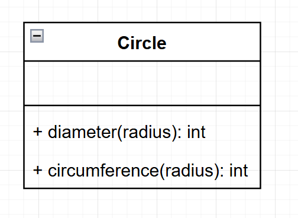
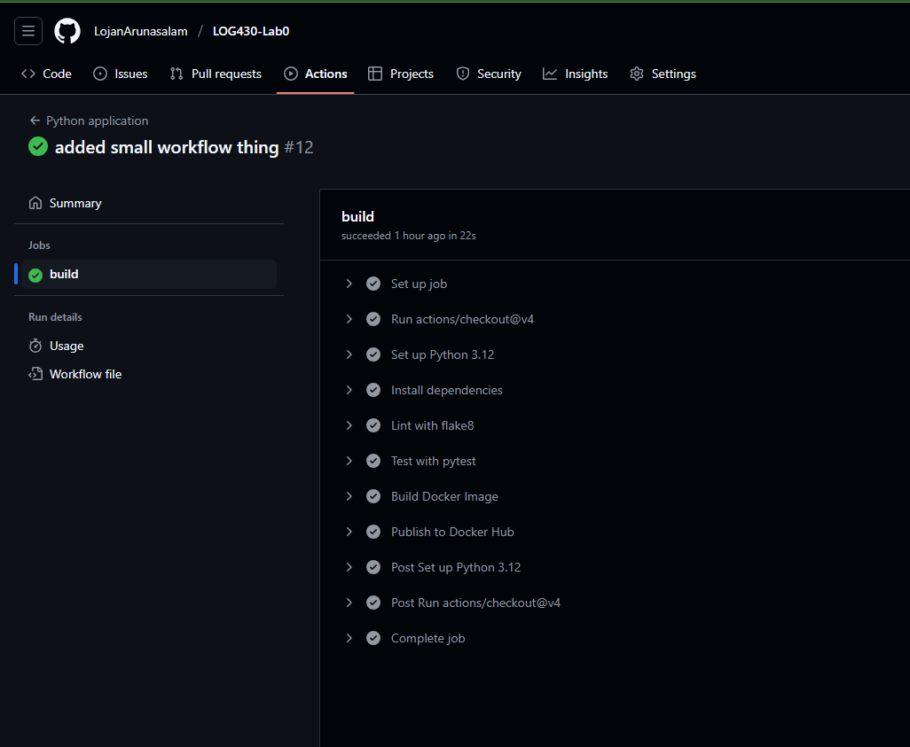

## LOG430-Lab0

# Architecture de l'application 


# Lancer le projet 
```
cd src 
python circle.py
```
# Lancer les tests
```
cd src 
pytest test_circle.py
```

# Execution reussie de la pipeline CI/CD
